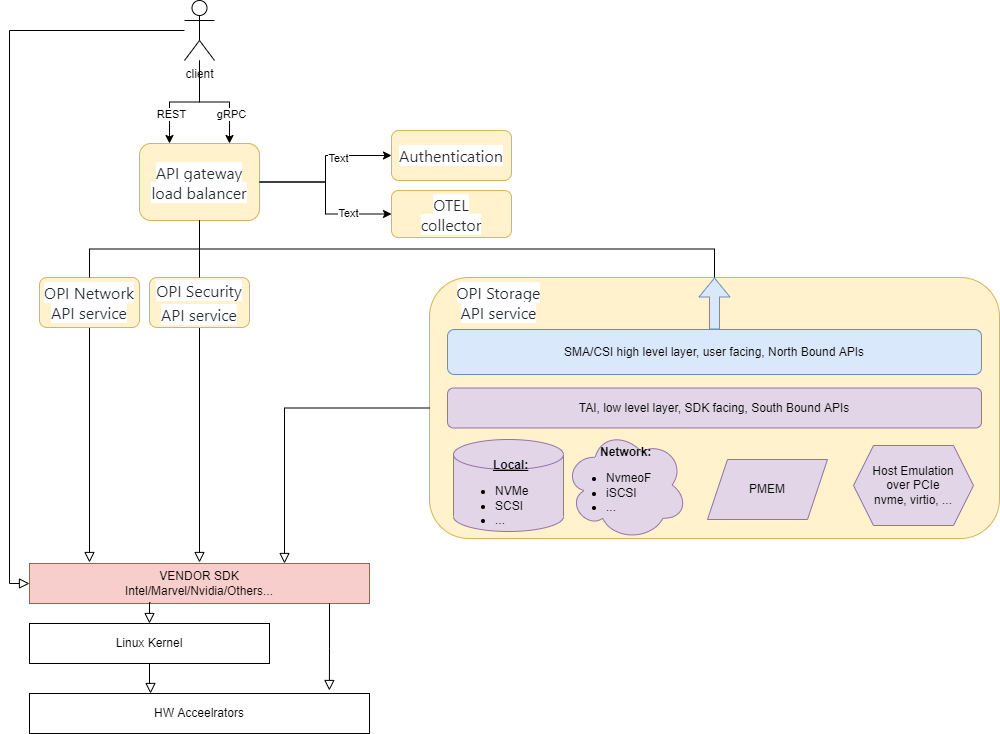

# OPI Storage APIs

## Implementation

The spec.md is implemented in proto. Compile it as:

```bash
   docker run -v $PWD:/defs namely/protoc-all -d proto -l go -o ./proto/  --go-source-relative
```

## Common APIs abstraction layer


## Storage APIs dual abstraction layer



## Storage Example use case


## Storage APIs layers

- We identified 3 layers of APIs in Storage
  - Front End
    - Those are *host* facing APIs
    - Examples are emulated NVMe devices or Virtio-blk devices
    - The APIs will have all the required properties for NVMe/Vritio specs
  - Middle End
    - Those are *storage services* APIs
    - They are implemented in DPU and provide with additional storage services (if applicable)
    - Few example: Raid protection, Compression, Encryption, Multipathing, QoS, and others...
  - Back End
    - Those are *network* facing APIs
    - We do want few devices for debug (null, malloc, delay, error injection)
    - Similar to what nvme-connect provides, for example (in a very simplistic way)
- Security
  - We do want to do security
  - For example: CHAP or AVE for iscsi and NVMe for authentication
  - For example: NVMe/TLS 1.3 for secure channel (similar for iscsi)
  - For implementation limitations we are not starting with those, but they are in design considerations
- Implementation
  - There are several existing implementations to consider (CSI, SMA, ...)
  - We have to start working in more details on this


